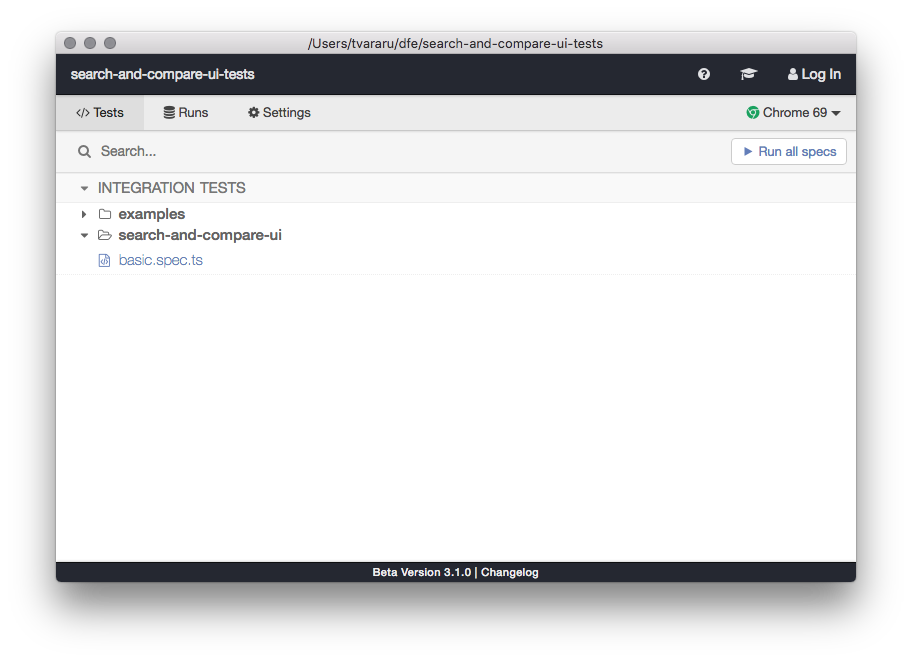
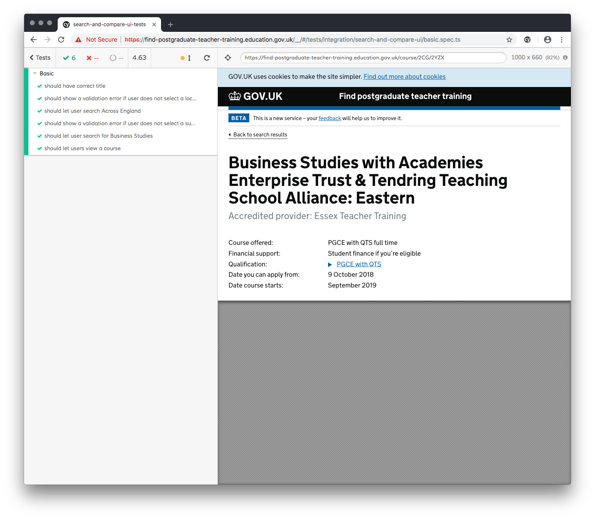
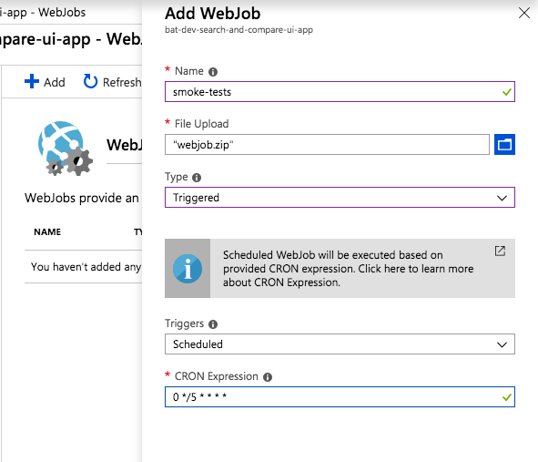

# Search and compare UI tests

These are smoke tests for the [Find postgraduate teacher training service](https://www.find-postgraduate-teacher-training.service.gov.uk). They aim to simulate a complete user journey from the perspective of the user, touching all parts of the stack along the way.

## Running locally

Install the dependencies (tested on node v10 and npm v6):

```bash
npm i
```

To run the tests in headless mode (like on CI):

```bash
npm test
```

To run the tests as they run on the Azure webjob (no streamed output; you'll need to set up the APPINSIGHTS_INSTRUMENTATIONKEY env var if you want to enable logging to Azure):

```bash
node webjob.js
```

To run the tests in development mode (a visible chrome window, with debugger, snapshots, which reloads when you make a change):

```bash
npm run cy:open
```

You should get this window:



Fold the `examples` folder and click on a spec from the `search-and-compare-ui` folder.

A Chrome window should appear and you should see something like:



## Writing tests

Tests are written using the [Cypress](https://www.cypress.io) framework. They are JavaScript-based (and run directly in the browser) but the specs themselves are written in TypeScript (which is a superset of ES6).

The relevant folders are:

```bash
cypress
├── fixtures
│   ├── example.json
│   ├── ...
├── integration
│   ├── examples
│   │   ├── actions.spec.ts
│   │   ├── ...
│   └── search-and-compare-ui
│       └── basic.spec.ts
├── plugins
│   └── index.ts
└── support
    ├── commands.ts
    └── index.ts
```

All tests should live under `cypress/integration/search-and-compare-ui`. The `examples` folder comes with Cypress and is left in for documentation purposes. 90% of common commands and assertions can be found there and played around with / copy pasted straight into new specs.

An end to end user journey should live in its own file in `search-and-compare-ui`; this helps with parallelization.

Shared commands and global variables can be defined in the `support` folder.

For those used to writing in other JS testing frameworks like `mocha` or `jasmine`, or using `webdriver`, here are some tips and gotchas:

- Tests are structured using Mocha BDD `describe/it/context/after/before/.only/.skip` blocks.
- There are `expect()`, `.should()`, and `assert.` style [assertions built-in](https://docs.cypress.io/guides/references/assertions.html).
- Cypress does not use `async/await`, all commands are queued onto a scheduler and the framework automatically manages waiting. Commands are promise-like with `.then` chaining, but crucially **they are not standard promises**. Most commands (even if async in nature) can be written in a synchronous style, because assertions have built-in waiting. [`cy.wait` shouldn't be necessary for most tests](https://docs.cypress.io/guides/references/best-practices.html#Unnecessary-Waiting).
- There is only one dependency, the `cypress` node package, but it comes with built-in support for `_`, `moment`, `$`, and [some other commonly used libraries](https://docs.cypress.io/guides/references/bundled-tools.html#Other-Library-Utilities).

## Deploying to Azure

We run a webjob on Azure which triggers a build on Travis every 5 minutes. The script is `webjob/webjob.sh`. To deploy this script:

1. Create a zip from the `webjob` folder from this repository
1. Navigate in Azure to `bat-dev-search-and-compare-ui-app`
1. Select WebJobs
1. Delete the old `smoke-tests` job
1. Add a new job, call it `smoke-tests`
1. Set the source to the zip you created earlier
1. Set it to be Triggered
1. Set the cron expression to the one in `webjob/settings.job`
1. OK it

It should look like this:



## License

[MIT](LICENCE).
